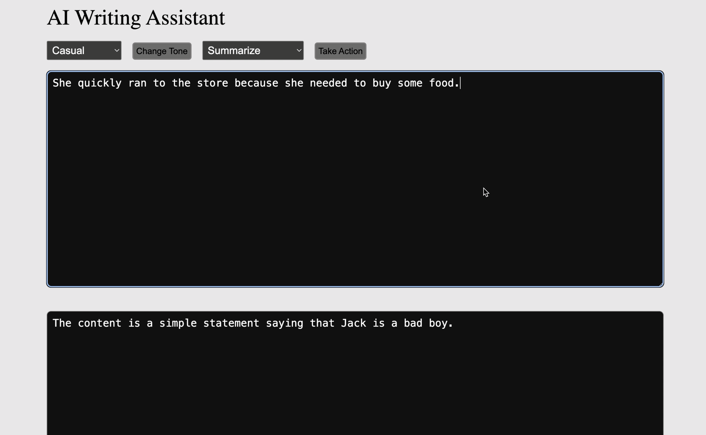

# Project Description
This project is a writing assistance tool that leverages OpenAI's API to enhance text editing capabilities. By integrating ChatGPT, the application allows users to rephrase, improve, and change the tone of their text. The tool provides an intuitive user interface where users can interact with the AI model for enhanced writing, whether for personal, academic, or professional purposes. The application utilizes OpenAI’s powerful language model to assist with content refinement in real-time.

# Demo

[](https://youtu.be/VAXOima-HVA)

## Key Skills Learned:
1. React: Built the user interface using React, creating components for the writing area, action buttons, and dynamic content updates.
2. Open API Integration: Integrated OpenAI’s API to interact with the language model for text rephrasing and tone adjustments.
3. State Management: Managed React app states to handle text changes and API responses seamlessly.
4. Event Handling: Implemented event handlers to trigger API calls and handle user inputs effectively.


## Technologies:
1. React
2. TypeScript
3. OpenAI API Integration

## Tasks Accomplished:
1. Set up OpenAI API configurations and created functions to call the API for text improvement.
2. Implemented multiple API features, such as style and tone changes, to provide users with various options for enhancing their content.
3. Built an API wrapper to streamline communication between the frontend and OpenAI API.

# How to use?
1. Install Node.js: Go to Node.js website.
2. Go to project directory & do 
```
npm install
```
3. Update your NEXT_PUBLIC_OPENAI_API_KEY in .env or create .env with NEXT_PUBLIC_OPENAI_API_KEY
3. Run dev server
```
PORT=3000 npm run dev
```
